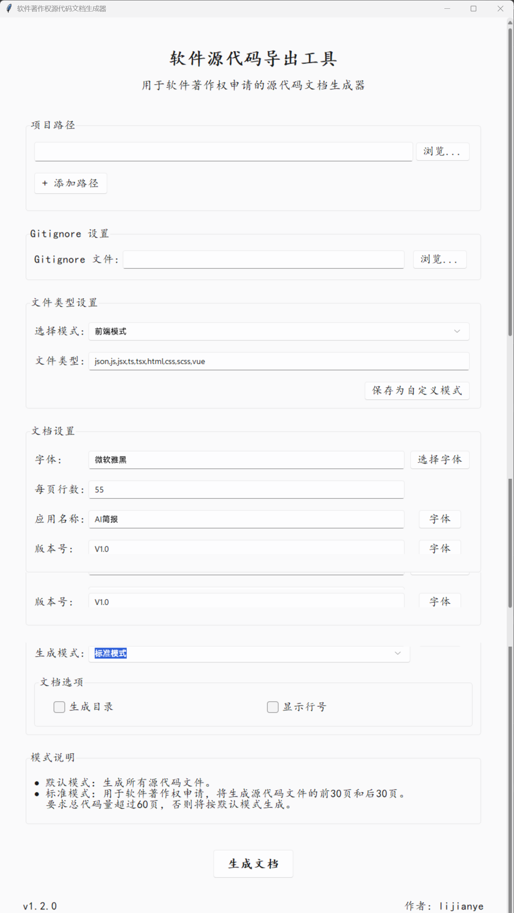

# 软件著作权源代码生成器 (Software Copyright Code Generator)

<div align="left">


**简体中文** | [English](./README_EN.md)

一款专为软件著作权申请设计的源代码文档生成工具，轻松将代码转换为标准格式文档

## 📸 截图展示



## ✨ 主要特性

- 🎨 **现代美观的界面** - 采用现代化UI设计，简洁直观的操作体验
- 📁 **多项目路径支持** - 可同时处理多个项目目录的代码文件
- 🔍 **智能代码过滤** - 支持.gitignore规则，自动过滤不需要的文件
- 📊 **多种文件类型模式** - 内置前端、后端、混合等多种预设模式，也支持自定义模式
- 📑 **自动生成目录** - 可选择是否自动生成文档目录结构
- 🔢 **代码行号显示** - 支持在生成的文档中显示代码行号
- 📝 **标准模式** - 专为软件著作权申请设计，自动生成前30页和后30页代码
- 🔧 **高度可定制** - 字体、行数、页眉等多种参数可自由设置

## 🚀 快速开始

### 安装依赖

```bash
pip install -r requirements.txt
```

### 运行程序

```bash
python src/main.py
```

### 使用方法

1. 选择一个或多个项目路径
2. 选择合适的文件类型模式（前端、后端或自定义）
3. 设置字体、每页行数等文档参数
4. 设置输出路径（可选）
5. 选择是否生成目录、显示行号等选项
6. 点击"生成文档"按钮

## 📦 打包发布

```bash
python -m PyInstaller SoftwareCopyrightGenerator.spec
```

## 🔧 高级配置

- **自定义文件类型模式**: 可以创建和保存自己的文件类型组合
- **多项目合并**: 支持将多个项目的代码合并到一个文档中
- **智能代码处理**: 自动处理编码问题，支持各种字符集

## 📋 适用场景

- 软件著作权申请材料准备
- 项目代码文档化
- 代码审查和评估
- 教学演示和培训材料

## 🤝 贡献指南

欢迎提交问题和功能请求！如果您想贡献代码，请：

1. Fork 本仓库
2. 创建您的特性分支 (`git checkout -b feature/amazing-feature`)
3. 提交您的更改 (`git commit -m 'Add some amazing feature'`)
4. 推送到分支 (`git push origin feature/amazing-feature`)
5. 打开一个 Pull Request

## 📄 许可证

本项目采用 MIT 许可证 - 详情请参阅 [LICENSE](LICENSE) 文件

## 👨‍💻 作者

**lijianye** - [GitHub主页](https://github.com/lijianye521)

---

<div align="center">
  <sub>如果这个项目对您有帮助，请考虑给它一个⭐️星！</sub>
</div>


